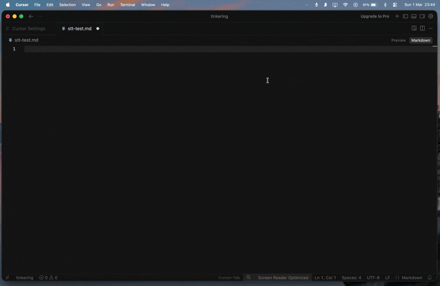

# Vox

**A native macOS speech-to-text menu bar app, built to understand what makes great dictation software great.**

Vox captures your speech, transcribes it locally using WhisperKit (OpenAI's Whisper on Apple Silicon), cleans up filler words, and inserts the text wherever your cursor is. No cloud. No subscription. No data leaves your machine.

I built this as a learning project. I wanted to rebuild a dictation app from scratch and understand which parts are model capabilities and which are product engineering.



**[Interactive STT pipeline visualizer](https://r-eehan.github.io/vox/visualizer/index.html)**: A visual explainer of how speech-to-text works under the hood, from microphone input to text insertion.

**[Code walkthrough](https://r-eehan.github.io/vox/vox-walkthrough.html)**: Annotated walkthrough of Vox's source code and architecture decisions. We recommend having the code open side by side for better understanding.

## Requirements

- **Apple Silicon Mac** (M1/M2/M3/M4). WhisperKit uses the Apple Neural Engine. Intel Macs are not supported.
- **macOS 14.0 Sonoma** or later
- **Xcode 16.0+** (full app from the Mac App Store, not just Command Line Tools). Needed for CoreML model compilation and dependency resolution.
- **[XcodeGen](https://github.com/yonaskolb/XcodeGen)** to generate the Xcode project from `project.yml`
- ~2 GB disk space for the WhisperKit model (downloaded automatically on first launch)

No Apple Developer account is needed. The app is signed ad-hoc ("Sign to Run Locally"), which Xcode does automatically when you build.

## Build and run

```bash
# Clone the repo
git clone https://github.com/R-eehan/vox.git
cd vox/xcode

# Install xcodegen (if you don't have it)
brew install xcodegen

# Generate the Xcode project
xcodegen generate

# Build
xcodebuild -project Vox.xcodeproj -scheme Vox -configuration Release build

# Copy to Applications
cp -R ~/Library/Developer/Xcode/DerivedData/Vox-*/Build/Products/Release/Vox.app /Applications/

# Launch
open /Applications/Vox.app
```

Or open `Vox.xcodeproj` in Xcode and hit Cmd+R.

On first launch, WhisperKit downloads the `large-v3-turbo` model (~1-2 GB). You'll see "Loading model..." in the menu bar. Subsequent launches load from cache in a few seconds.

## Permissions

Vox needs two macOS permissions:

- **Microphone**: Prompted automatically on first launch
- **Accessibility**: Required for pasting text into other apps. Go to System Settings > Privacy & Security > Accessibility and add Vox

Because the app uses ad-hoc signing, macOS may ask you to re-grant permissions after each rebuild. This is expected. TCC (the permission system) tracks grants by code signature, which changes on every build.

## Usage

1. Look for the Vox icon in the macOS menu bar
2. Press **Option+Space** to start dictation
3. Speak naturally
4. Press **Option+Space** again to stop. Your text appears where your cursor is.

## How it works

```
[Hotkey] → [Audio Capture] → [Resample] → [Model Inference] → [Text Cleanup] → [Text Insertion]
 ⌥ Space   AVAudioEngine     48kHz→16kHz   WhisperKit          Filler word       Clipboard +
                              linear        large-v3-turbo      removal           Cmd+V paste
                              interpolation
```

Audio is captured at the hardware sample rate (typically 48kHz) and resampled to 16kHz using linear interpolation before being fed to WhisperKit. The resampling approach was adapted from [VoiceInk](https://github.com/Beingpax/VoiceInk).

See [docs/architecture.md](docs/architecture.md) for the detailed breakdown.

## Architecture

All source files live in `xcode/Vox/`:

| File | Purpose |
|------|---------|
| `VoxApp.swift` | App entry point, menu bar UI |
| `AppController.swift` | Pipeline orchestrator, state machine |
| `AudioCapture.swift` | Microphone capture with 16kHz resampling |
| `Transcriber.swift` | WhisperKit model integration |
| `TextProcessor.swift` | Filler word removal (regex) |
| `TextInserter.swift` | Clipboard paste into active app |
| `HotkeyManager.swift` | Global hotkey registration |
| `ModelManager.swift` | Model path management |

The Xcode project is generated from `project.yml` using XcodeGen.

## Distribution

Vox is build-from-source only. You cannot share the built `.app` with others because ad-hoc signing only works on the machine that built it. macOS Gatekeeper blocks ad-hoc signed apps transferred to another Mac.

For distributable builds, you'd need an Apple Developer account ($99/yr) for Developer ID signing and notarization.

## License

MIT

## Acknowledgments

Vox was inspired by and adapted from [VoiceInk](https://github.com/Beingpax/VoiceInk) by Beingpax. VoiceInk is a fully-featured macOS dictation app, and studying its implementation was how I figured out how audio capture, resampling, and text insertion actually work in practice. Vox doesn't replicate VoiceInk. I used VoiceInk's codebase as a reference to understand patterns like linear interpolation resampling, CGEvent-based text insertion, and thread-safe audio buffering.

- [WhisperKit](https://github.com/argmaxinc/WhisperKit) by Argmax: Swift-native Whisper for Apple Silicon
- [HotKey](https://github.com/soffes/HotKey) by Sam Soffes: Global hotkey library
- [Wispr Flow](https://www.wispr.com/): The product that inspired this project
